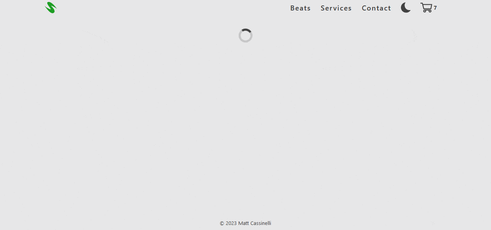

# Music Store

## Tech stack

* .NET 8
* PostgreSQL
* Entity Framework
* React
* Tailwind CSS

## How to run locally

1. Download and install [.NET 6](https://dotnet.microsoft.com/en-us/download)
2. Download and start [Docker Desktop](https://www.docker.com/products/docker-desktop/)
3. Start Azurite (included with Visual Studio 2022)
4. Download and start [Azure Storage Explorer](https://azure.microsoft.com/en-us/products/storage/storage-explorer/#Download-4)
5. Under 'Emulator - Default Ports' > Blob Containers, create a new container named 'preview-clips'
6. Open a terminal and `cd` to `\MusicStore.Server\`
7. Run `docker-compose up -d`
8. Perform a [migration](https://learn.microsoft.com/en-us/ef/core/managing-schemas/migrations):
    1. `dotnet ef migrations add v1 -o .\EntityFramework\Migrations`
    2. Subsequent migrations can be named `v2` etc.
    3. `dotnet ef database update`
9. Start the API server with `dotnet run`, or pressing F5 in Visual Studio
10. Start the frontend:
    1. In another terminal, `cd` to `\MusicStore.Client\`
    2. `npm install`
    3. `npm run dev`

Optional: Install [this VS Code extension](https://marketplace.visualstudio.com/items?itemName=ckolkman.vscode-postgres) to manually explore the database.
